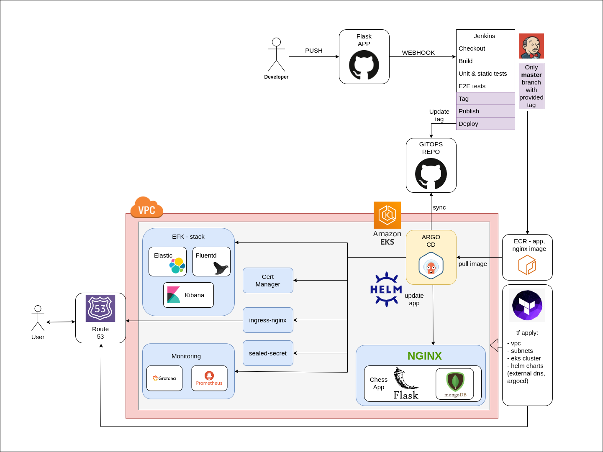

<h3 align="center">Chess openings database</h3>

<div align="center">
  database for your games & openings
</div>

---

<p align="center"> Simple app to store your chess games, and opening collection.
    <br> 
</p>

## 📝 Table of Contents

- [About](#about)
- [Getting Started](#getting_started)
- [Usage](#usage)
- [Built Using](#built_using)
- [Authors](#authors)
- [APP Preview](#app-preview)

## 🧐 About <a name = "about"></a>

Application written as final project for develeap bootcamp

## 🏁 Getting Started <a name = "getting_started"></a>

These instructions will get you a copy of the project up and running on your local machine for development and testing purposes. See [deployment](#deployment) for notes on how to deploy the project on a live system.

Other repositories linked to this project:

```
https://github.com/maciejgrosz/chess-openings-helmcharts - helm repository
https://github.com/maciejgrosz/chess-openings-terraform - terraform repository
https://github.com/maciejgrosz/chess-openings-gitops - gitops repository
```
### Prerequisites

What things you need to install the software and how to install them.

```
- docker
- docker-compose
```

### Installing

To run application on localhost run:

```
docker-compose up --build -d 
```

## 🔧 Running the tests <a name = "tests"></a>

To run tests use docker container:
```
docker exec app tests/unit_tests.py
docker exec app tests/e2e_tests.py
```

### Break down into end to end tests


E2E tests are testing database utility as:

```
- add opening, delete opening, edit opening
- add game, delete game, edit game
```


### And coding style tests

In jenkinsfile is implemented black test as pytest plugin:

```
pytest --black .
```

## 🎈 Usage <a name="usage"></a>

You can add openings that you play to your collection with initial moves and eco codes. And also you can add games to openings "class".

Eg. You can storage all your Ruy Lopez games under Ruy Lopez Collection and easily search for them.


## ⛏️ Built Using <a name = "built_using"></a>

 - Backend: Python (Flask)
 - Database: Mongodb
 - Frontend: Jinja, Bootstrap
 - Dockerized with docker-composed.yaml (three tier architecture)
 - Web server: Nginx
 - Tests: pytest
 - CI with jenkins

## ✍️ Authors <a name = "authors"></a>

- [@maciejgrosz](https://github.com/maciejgrosz) 

## APP architecture




## APP preview

